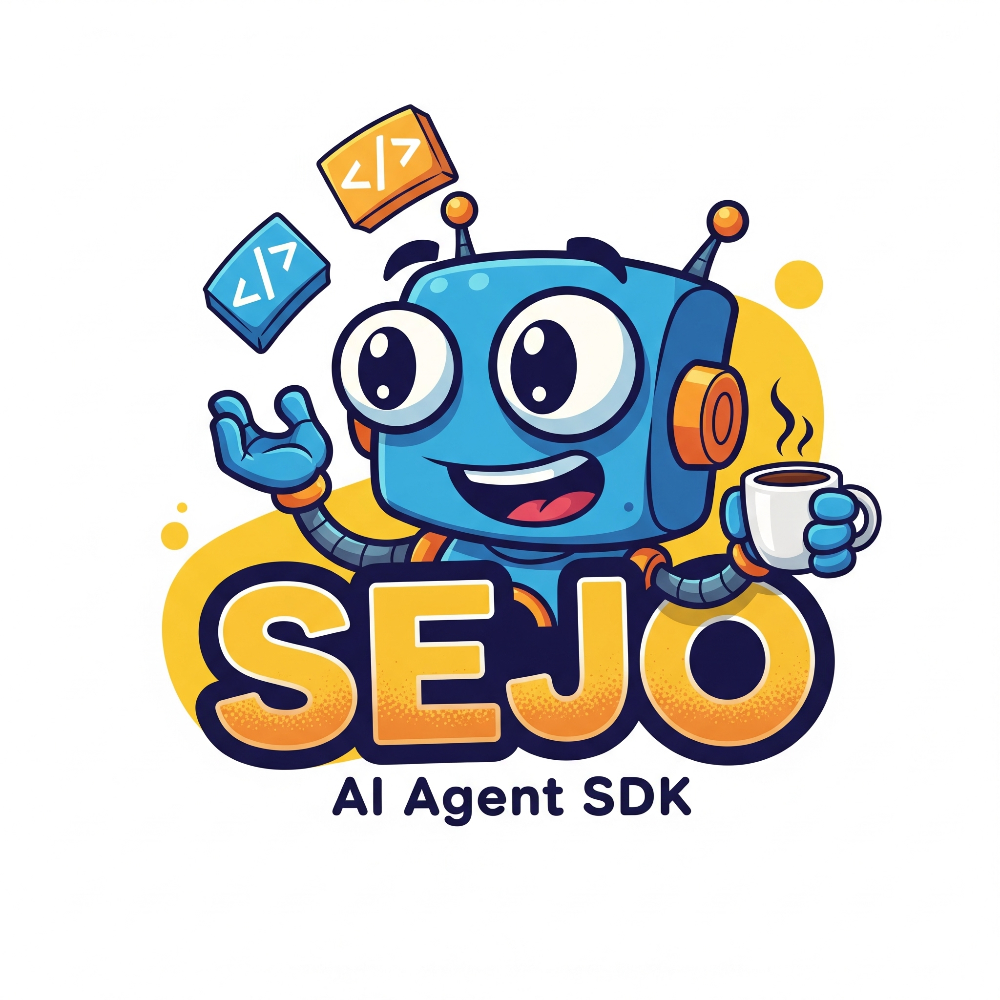

# SEJO SDK

[](https://github.com/jmiguelmangas/SEJO_SDK/actions/workflows/ci.yml)


<p align="center">
  
</p>

SEJO SDK is a lightweight Python SDK for building provider-agnostic AI agents.
It gives you one small interface for model adapters, conversation memory,
streaming responses and optional tools.

The project is currently alpha, but the core package is designed to be
installable without pulling every provider dependency. Add only the extras you
need.

## Features

- Unified `ModelClient` interface — one API for all providers.
- Sync **and** async model clients for every supported provider.
- Agent runtime with conversation `Memory`.
- Native `send_messages` / `stream_messages` — full message history, not a rendered string.
- System prompts applied automatically to every turn.
- Native tool calling for **OpenAI, Anthropic, Gemini and Bedrock (Claude)**.
- `RetryModel` / `FallbackModel` — exponential back-off and provider chaining.
- `PromptTemplate` — named variable substitution for reusable prompts.
- `run_structured()` — Pydantic-validated responses from any agent.
- Built-in tracing and cost estimation (`Tracer`).
- Session store: `InMemorySessionStore`, `PostgresSessionStore`, `RedisSessionStore`.
- `create_agent_app()` — FastAPI server with REST + WebSocket endpoints.
- **Multi-agent**: `agent.as_tool()` wraps any agent as a tool; `agent.delegate()` for direct sub-agent calls.
- **Evals**: `EvalSuite` runs a test dataset against an agent with built-in scorers (`exact_match`, `contains`, `contains_all`, `llm_judge`).
- Tests run without API keys or live provider calls.

## Provider support

| Provider | send_messages | tool calling | streaming |
|---|---|---|---|
| OpenAI / DeepSeek | ✅ | ✅ native | ✅ |
| Anthropic | ✅ | ✅ native | ✅ |
| Gemini | ✅ | ✅ native | ✅ |
| AWS Bedrock (Claude) | ✅ | ✅ native | ✅ |
| AWS Bedrock (Titan/Llama/Mistral) | ✅ | — | ✅ |

## Installation

Install the core package:

```bash
pip install sejo-sdk
```

Install provider extras as needed:

```bash
pip install "sejo-sdk[openai]"
pip install "sejo-sdk[anthropic]"
pip install "sejo-sdk[gemini]"
pip install "sejo-sdk[bedrock]"
pip install "sejo-sdk[websearch]"
pip install "sejo-sdk[postgres]"
pip install "sejo-sdk[redis]"
pip install "sejo-sdk[server]"
pip install "sejo-sdk[structured]"   # Pydantic structured outputs
pip install "sejo-sdk[all]"          # everything
```

For local development:

```bash
python -m pip install -e ".[dev]"
pytest
ruff check .
```

## Basic Usage

```python
from SEJO_SDK.agent import Agent
from SEJO_SDK.models import OpenAIModel

model = OpenAIModel(
    api_key="your-api-key",
    model_name="your-model-name",
)

agent = Agent(model=model)
response = agent.run("What is the capital of Spain?")

print(response)
```

## Streaming

```python
for chunk in agent.stream("Explain machine learning in one paragraph."):
    print(chunk, end="")
```

## Async Usage

```python
import asyncio

from SEJO_SDK.agent import Agent
from SEJO_SDK.models import AsyncOpenAIModel


async def main():
    model = AsyncOpenAIModel(
        api_key="your-api-key",
        model_name="your-model-name",
    )
    agent = Agent(model=model)

    response = await agent.arun("What is the capital of Spain?")
    print(response)

    async for chunk in agent.astream("Explain async Python in one paragraph."):
        print(chunk, end="")


asyncio.run(main())
```

## Tools

```python
from SEJO_SDK.agent import Agent
from SEJO_SDK.models import OpenAIModel
from SEJO_SDK.tools import Tool


def add(left: int, right: int) -> int:
    return left + right


add_tool = Tool(
    name="add",
    description="Add two integers.",
    func=add,
    parameters={
        "type": "object",
        "properties": {
            "left": {"type": "integer"},
            "right": {"type": "integer"},
        },
        "required": ["left", "right"],
    },
)

agent = Agent(
    model=OpenAIModel(api_key="your-api-key", model_name="your-model-name"),
    tools=[add_tool],
)

print(agent.tool_schemas())
print(agent.run_tool("add", left=2, right=3))
```

## Tool-Calling Loop

```python
from SEJO_SDK.messages import ModelResponse, ToolCall


class ToolCallingModel(ModelClient):
    def send_prompt(self, prompt: str, **kwargs):
        return ModelResponse(
            tool_calls=[
                ToolCall(
                    name="add",
                    arguments={"left": 2, "right": 3},
                )
            ],
        )

    def stream_response(self, prompt: str, **kwargs):
        yield "unused"


agent = Agent(model=ToolCallingModel(), tools=[add_tool])
response = agent.run_with_tools("What is 2 + 3?")
```

## Native Messages & System Prompts

```python
from SEJO_SDK.agent import Agent
from SEJO_SDK.messages import system_message, user_message


agent = Agent(
    model=model,
    system_prompt="Answer in one sentence.",
)

response = agent.run("What is SEJO SDK?")

# Or send messages directly to the model
direct = model.send_messages(
    [
        system_message("Be concise."),
        user_message("Hello"),
    ]
)
```

Each provider converts the message list to its native format:

| Provider | `send_messages` | `stream_messages` | Tool calling |
|----------|----------------|-------------------|--------------|
| OpenAI   | Chat dicts     | Native            | Native       |
| DeepSeek | Chat dicts     | Native            | Native       |
| Anthropic | `system` arg + chat | Native      | Native (`tool_use` / `tool_result`) |
| Gemini   | Prompt string  | Prompt string     | Planned      |

## Anthropic Tool Calling

```python
from SEJO_SDK.agent import Agent
from SEJO_SDK.models import AnthropicModel
from SEJO_SDK.tools import Tool


def search(query: str) -> str:
    return f"Results for: {query}"


agent = Agent(
    model=AnthropicModel(api_key="...", model_name="claude-3-5-haiku-20241022"),
    tools=[Tool(name="search", description="Search the web.", func=search)],
)

response = agent.run_with_tools("Search for SEJO SDK")
```

Tool schemas are automatically converted from the OpenAI-compatible format to
Anthropic's `input_schema` shape. Tool results are serialised as `tool_result`
content blocks so multi-turn tool conversations work correctly.

## Custom Model Adapter

```python
from typing import Iterator

from SEJO_SDK.model import ModelClient


class EchoModel(ModelClient):
    def send_prompt(self, prompt: str, **kwargs) -> str:
        return f"Echo: {prompt}"

    def stream_response(self, prompt: str, **kwargs) -> Iterator[str]:
        yield "Echo: "
        yield prompt
```

For async adapters, subclass `AsyncModelClient` and implement `async
send_prompt` plus an async `stream_response` generator.

To support native message streaming, override `stream_messages` (optional —
falls back to `stream_response` with a rendered prompt string).

## Project Structure

```text
SEJO_SDK/
  agent.py                  Agent runtime.
  memory.py                 Conversation memory.
  model.py                  Provider-agnostic model interface.
  messages.py               Typed messages, tool calls and model responses.
  models/                   OpenAI, Anthropic, Gemini and DeepSeek adapters.
  tools/                    Tool primitives and optional integrations.
  utils/                    Utility helpers and database connector.
tests/                      Unit tests without live provider calls.
examples/                   Small sync, async and tool examples.
```

## Quality

```bash
python -m compileall SEJO_SDK tests
ruff check .
pytest --cov=SEJO_SDK --cov-report=term-missing
mkdocs build --strict
python -m build
twine check dist/*
```

## Documentation

Extended documentation lives in [`docs/`](docs/index.md):

- [Getting Started](docs/getting-started.md)
- [Core Concepts](docs/concepts.md)
- [Memory](docs/memory.md)
- [Providers](docs/providers.md)
- [Errors](docs/errors.md)
- [CLI](docs/cli.md)
- [Examples](docs/examples.md)
- [Testing](docs/testing.md)
- [API Reference](docs/api-reference.md)
- [Release Checklist](docs/release-checklist.md)

**Guides:**

- [Sync Agents](docs/guides/sync-agents.md)
- [Async Agents](docs/guides/async-agents.md)
- [Native Messages](docs/guides/native-messages.md)
- [Tools](docs/guides/tools.md)

Run the docs site locally:

```bash
mkdocs serve
```

Run the CLI health check:

```bash
sejo doctor
```

## Project Governance

- [Changelog](CHANGELOG.md)
- [Contributing](CONTRIBUTING.md)
- [Security Policy](SECURITY.md)

## Roadmap

- Native tool calling for Gemini.
- Native message streaming for Gemini (`stream_messages` override).
- Provider-specific integration tests behind opt-in environment variables.
- Publish generated API documentation.

## Contact

- GitHub: [jmiguelmangas](https://github.com/jmiguelmangas)
- Email: [jmmangas@gmail.com](mailto:jmmangas@gmail.com)

## License

MIT. See [LICENSE](LICENSE).
